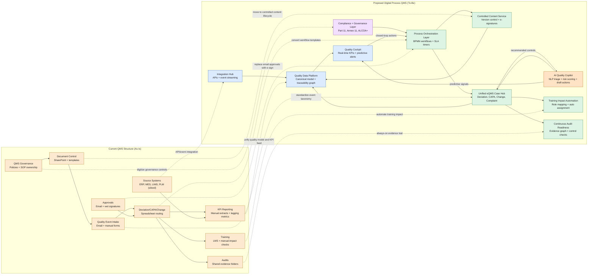

# QMS Digital Process Solution (Tailored Draft)

This draft maps the current QMS structure/functionality and a proposed digital process
solution with AI-enabled decision support and a clear operating model.

## System Diagram

## RACI Overlay

| Process | Responsible (R) | Accountable (A) | Consulted (C) | Informed (I) |
|---|---|---|---|---|
| Deviation intake and triage | Quality Ops | Head of Quality | Manufacturing | QA Systems |
| CAPA planning and closure | Process Owner | Head of Quality | Regulatory | Data and AI |
| Change control workflow | Change Coordinator | Quality Governance | IT Validation | Site Ops |
| Training impact assignment | Training Lead | Quality Governance | HR | Process Owner |
| Audit evidence readiness | Audit Lead | Head of Quality | All Functions | QA Systems |
| AI recommendation approval | Quality Ops | Quality Governance | Data Science | Regulatory |
| KPI and risk signal governance | Quality Analytics | Head of Quality | Site Leadership | Quality Ops |

## Rollout Waves

1. Wave 1 (8-12 weeks): unify taxonomy and digitize deviation/CAPA/change workflows.
2. Wave 2 (6-10 weeks): connect ERP/MES/LIMS and establish canonical quality data model.
3. Wave 3 (6-8 weeks): deploy AI triage, risk scoring, and recommendation governance.
4. Wave 4 (4-6 weeks): scale predictive cockpit, control monitoring, and continuous improvement automation.

## Target KPI Outcomes

- Deviation triage time: reduce by 40 percent
- CAPA cycle time: reduce by 25 percent
- On-time training completion after change: increase to 98 percent
- Audit evidence retrieval time: reduce by 60 percent
- Recurrence rate for high-risk deviations: reduce by 30 percent

## How Target Outcomes Are Measured

| Domain | Metric | Measurement Formula | Data Source | Cadence | Target | Patient Safety Link |
|---|---|---|---|---|---|---|
| Patient Safety | Safety review coverage for high-risk cases | (# high-risk cases with documented AI plus human safety review / total high-risk cases) x 100 | eQMS case records + PV safety system | Weekly | >=99% | Prevents unsupervised AI decisions for patient-impacting events |
| Patient Safety | Critical escalation SLA attainment | (# critical quality events escalated within SLA / total critical events) x 100 | Workflow timestamps | Daily | >=98% | Shortens time to containment and clinical risk mitigation |
| Usage | Weekly active quality users | Count of unique users executing quality workflows per week | Identity + workflow logs | Weekly | +15% in first 90 days | Higher adoption improves consistency of safety controls |
| Usage | Digital workflow completion rate | (# cases completed in orchestrated workflow / total cases) x 100 | Workflow engine | Weekly | >=95% | Reduces off-system workarounds that hide safety risk |
| Usage | AI recommendation acceptance with rationale | (# accepted AI recommendations with reviewer rationale / total AI recommendations) x 100 | AI decision logs | Weekly | Track trend, no forced target | Ensures AI remains decision support, not autonomous control |
| ESG | Paperless quality record rate | (# records fully digital and e-signed / total quality records) x 100 | DMS + e-signature logs | Monthly | >=90% by wave 3 | Improves traceability while reducing paper-intensive processes |
| ESG | Deviation rework reduction | ((baseline rework hours - current rework hours) / baseline rework hours) x 100 | Manufacturing + quality logs | Monthly | >=20% reduction | Lower rework reduces process instability and quality drift |
| ESG | Investigation cycle energy intensity | kWh consumed per completed investigation | Site utility + process telemetry | Quarterly | Downward trend | Supports sustainable operations without compromising quality |
| Verifiability | End-to-end traceability completeness | (# cases with linked source data, model output, reviewer decision, and CAPA action / total cases) x 100 | Quality data platform | Weekly | >=98% | Enables root-cause reconstruction for safety investigations |
| Verifiability | Model output reproducibility | (# sampled inferences reproducible within tolerance / total sampled inferences) x 100 | Model registry + replay harness | Weekly | >=99% | Prevents non-deterministic safety decisions |
| Compliance | Part 11 / Annex 11 control pass rate | (# required controls passing automated checks / total required controls) x 100 | Compliance control monitor | Weekly | 100% | Maintains regulatory integrity of quality decisions |
| Compliance | ALCOA+ data-integrity exception rate | (# ALCOA+ exceptions / total quality records) x 100 | Audit trail analyzer | Weekly | <0.5% | Protects evidentiary quality for patient-impacting decisions |

## Usage Outcomes

- Weekly active quality users and digital workflow completion rate by site and function
- AI recommendation usage distribution by process type and severity class
- Override rates segmented by role with mandatory rationale capture
- Time-to-first-action after AI triage versus manual baseline

## ESG Outcomes

- Paperless quality record adoption and paper reduction trend
- Deviation rework hour reduction and right-first-time improvement
- Investigation cycle energy intensity and compute utilization trend
- Supplier quality interaction digitalization rate (fewer manual exchanges)

## Verifiability and Compliance Assessments

| Assessment Area | Verification Method | Evidence | Cadence | Gate |
|---|---|---|---|---|
| GxP impact classification | Every AI-enabled workflow has documented GxP impact category | Control owner attestation + QA review | At release and at each major change | Block release if missing |
| Computer software assurance (CSA) | Risk-based validation protocol with objective evidence | Validation package in controlled repository | Before production and per change request | Block release if failed |
| Human oversight enforcement | No autonomous closure for patient-safety relevant records | Workflow rule tests + periodic audit samples | Continuous | Auto-escalate any violation |
| Audit trail integrity | Immutable logs for data access, model calls, approvals, overrides | Automated integrity checks | Daily | Critical incident if tampering detected |
| Model change control | Approved change ticket, validation evidence, rollback plan | Change advisory board record | Per model or prompt update | Reject deployment if incomplete |
| Bias and performance drift | Defined thresholds by case class and severity | Monitoring dashboard + periodic challenge tests | Weekly + monthly deep dive | Freeze model if threshold breached |

## AI Regulator Stress-Test Hardening

| Hardening Area | Implementation Pattern | Anticipated Regulator Question | Evidence Package | Enforcement Rule |
|---|---|---|---|---|
| Full-stack inventory with risk tags | Maintain a live inventory for every service, model endpoint, integration, queue, database, and vendor dependency. Record GxP impact, data class, risk tier, owner, and control owner. | How do you know no hidden component bypasses controls? | Versioned system inventory export with owner and control-owner attestations. | Release gate fails if any high-risk component is missing owner, control owner, or risk label. |
| Control-to-implementation graph | Map each policy control to workflow rules, code checks, telemetry, and evidence artifacts using deterministic control IDs. | Can you prove controls are implemented and monitored, not only documented? | Control matrix with policy links, implementation refs, telemetry refs, and evidence paths. | Promotion is blocked if policy, implementation, telemetry, or evidence link is missing. |
| Signed release evidence bundle | Generate a signed package per release containing commit SHAs, model and prompt versions, gate results, approvals, exceptions, SBOM, and provenance references. | Show complete evidence for the exact production release. | Signed release manifest, checksums, and immutable artifact references. | Release promotion is blocked if signature or manifest completeness validation fails. |
| Decision reproducibility harness | Replay sampled recommendations with version-pinned model and retrieval context to verify deterministic behavior within tolerance bounds. | Can you reproduce this decision and explain differences? | Replay report with case ID, input hash, output hash, tolerance, and pass or fail status. | Weekly reproducibility pass rate must meet threshold by risk class. |
| Prompt and model change control | Treat prompt and model updates as controlled quality changes requiring risk assessment, validation protocol, rollback plan, and accountable signoff. | How are prompt and model changes governed under quality management? | Change ticket package with validation evidence, approval chain, and rollback simulation. | Merge fails when required change-control metadata or approvals are missing. |
| Adversarial and abuse-case testing | Run scheduled test suites for prompt injection, unsafe output patterns, citation poisoning, and context-boundary failures. | How do you prove resilience to misuse and hostile inputs? | Adversarial test matrix, failure trends, and corrective-action records. | Critical adversarial failures block release until corrective actions are verified. |
| Immutable lineage and rapid reconstruction | Capture tamper-evident lineage linking inputs, retrieval traces, model outputs, reviewer decisions, and final workflow actions. | Can you reconstruct a safety-critical decision quickly for investigators? | Cryptographically chained event logs with reconstruction report and retrieval timings. | Investigation packet generation must complete within defined service-level objective. |

## Anticipated AI-Assisted Regulatory Challenges and Prepared Answers

| Anticipated AI-Assisted Regulatory Challenge | Prepared Response | Demonstrable Artifact |
|---|---|---|
| Show all AI-relevant systems and data paths across the enterprise stack. | Provide the full-stack inventory with risk tags, ownership, and GxP impact classes. | Inventory register plus ownership attestations and dependency export. |
| Prove each required control is enforced at runtime. | Use the control-to-implementation graph linking policy to code, telemetry, and evidence artifacts. | Control matrix with current status per control ID. |
| Produce complete evidence for this release. | Deliver the signed release evidence bundle with manifest, checksums, and traceable references. | Signed release dossier generated from CI promotion stage. |
| Replay one historical recommendation and confirm consistency. | Run the reproducibility harness for the selected case and provide tolerance-based comparison output. | Replay report including hashes, score deltas, and pass or fail verdict. |
| Explain how prompt and model updates are controlled. | Show change-control records with risk assessment, validation evidence, rollback plan, and approvals. | Model and prompt change package with full audit trail. |
| Demonstrate protection against misuse and adversarial manipulation. | Provide scheduled adversarial testing results and corrective-action evidence. | Adversarial suite run history and remediation tracking. |
| Reconstruct this case end-to-end for investigation. | Use immutable lineage logs to generate a complete chronology from input to final action. | Investigator packet with timestamps, actor IDs, model versions, and citation refs. |

## Release Evidence Bundle Minimum Fields

Minimum signed release evidence bundle fields:

- release_id and release timestamp
- source commit SHAs and build run IDs
- model version and prompt version identifiers
- SBOM reference and provenance reference
- validation summary and gate verdicts
- approval records and exception records
- checksum manifest and signing certificate reference

## Strict P0 Launch Release Gates (QMS Resume Reviewer)

| Gate ID | P0 Launch Blocker | Required Evidence | Enforcement Point | Fail-Closed Action |
|---|---|---|---|---|
| RG-02 | Control-to-implementation runtime coverage | Control matrix linking policy IDs to code checks, telemetry, and evidence paths | CI promotion gate | Block release when any required control link is missing or stale |
| RG-03 | Signed release evidence bundle | Signed manifest with commit SHAs, model and prompt versions, SBOM, provenance, approvals, and checksums | Release packaging gate | Block release when signature validation or manifest completeness fails |
| RG-04 | High-risk human review enforcement | Reviewer sign-off records for all high-risk recommendations and overrides | Runtime workflow gate | Prevent case closure and raise escalation when sign-off is missing |
| RG-05 | Prompt and model change control | Change ticket with risk assessment, validation evidence, rollback plan, and approvals | Merge and deploy gate | Reject merge and deployment for unapproved prompt or model changes |
| RG-08 | Immutable lineage and reconstruction readiness | Tamper-evident lineage logs and successful investigator packet generation report | Pre-production operational readiness gate | Block release when end-to-end reconstruction service-level objective is unmet |

## P1 Post-Launch Enforcement Gates (Marked)

| Gate ID | P1 Post-Launch Enforcement | Required Evidence | Enforcement Point | Post-Launch Rule |
|---|---|---|---|---|
| RG-01 | Inventory and ownership completeness | Full-stack inventory export with risk labels, owner, and control owner | CI pre-release gate | Enable within 30 days after launch; block next release if unresolved |
| RG-06 | Decision reproducibility threshold | Replay harness report with case IDs, input and output hashes, tolerance, and verdict | Weekly reliability gate | Enable within 30 days after launch; block next release if unresolved |
| RG-07 | Adversarial misuse resilience | Adversarial suite run log with failure severity and corrective action evidence | Security quality gate | Enable within 45 days after launch; block next release if unresolved |

## Full Regulatory Gate Catalog (Tiered Reference)

| Gate ID | Launch Tier | Regulatory Gate | Required Evidence | Enforcement Point | Enforcement Outcome |
|---|---|---|---|---|---|
| RG-01 | P1 Post-Launch | Inventory and ownership completeness | Full-stack inventory export with risk labels, owner, and control owner | CI pre-release gate | Do not block initial launch; Enable within 30 days after launch; block next release if unresolved |
| RG-02 | P0 Launch Blocker | Control-to-implementation runtime coverage | Control matrix linking policy IDs to code checks, telemetry, and evidence paths | CI promotion gate | Block release when any required control link is missing or stale |
| RG-03 | P0 Launch Blocker | Signed release evidence bundle | Signed manifest with commit SHAs, model and prompt versions, SBOM, provenance, approvals, and checksums | Release packaging gate | Block release when signature validation or manifest completeness fails |
| RG-04 | P0 Launch Blocker | High-risk human review enforcement | Reviewer sign-off records for all high-risk recommendations and overrides | Runtime workflow gate | Prevent case closure and raise escalation when sign-off is missing |
| RG-05 | P0 Launch Blocker | Prompt and model change control | Change ticket with risk assessment, validation evidence, rollback plan, and approvals | Merge and deploy gate | Reject merge and deployment for unapproved prompt or model changes |
| RG-06 | P1 Post-Launch | Decision reproducibility threshold | Replay harness report with case IDs, input and output hashes, tolerance, and verdict | Weekly reliability gate | Do not block initial launch; Enable within 30 days after launch; block next release if unresolved |
| RG-07 | P1 Post-Launch | Adversarial misuse resilience | Adversarial suite run log with failure severity and corrective action evidence | Security quality gate | Do not block initial launch; Enable within 45 days after launch; block next release if unresolved |
| RG-08 | P0 Launch Blocker | Immutable lineage and reconstruction readiness | Tamper-evident lineage logs and successful investigator packet generation report | Pre-production operational readiness gate | Block release when end-to-end reconstruction service-level objective is unmet |

## Applied Regulatory Gate Implementation for QMS Resume Reviewer

| QMS Resume Reviewer Surface | Applied Gates | Applied Implementation Pattern | Launch Tier | User Burden Profile |
|---|---|---|---|---|
| Case intake and triage (launch baseline) | RG-02 | Register each workflow, queue, and dependency in inventory and map policy controls to enforcement checks before enabling route | P0 Launch Blocker | No manual user input; generated from configuration and workflow metadata |
| Case intake and triage (post-launch hardening) | RG-01 | Backfill and continuously reconcile full-stack inventory ownership metadata for all non-critical components | P1 Post-Launch | No manual user input; generated from configuration and workflow metadata |
| AI recommendation generation | RG-04, RG-08 | Capture model version, prompt version, retrieval trace, output, and actor context in immutable lineage for every recommendation | P0 Launch Blocker | No extra steps for normal use; automatic capture |
| High-risk recommendation approval | RG-04 | Require accountable reviewer sign-off and rationale before any patient-impacting action can proceed | P0 Launch Blocker | One mandatory rationale step for high-risk actions only |
| Prompt and model update workflow (launch baseline) | RG-05 | Enforce approved change ticket with risk assessment, validation protocol, rollback plan, and accountable approvals before merge | P0 Launch Blocker | No operator burden; engineering workflow gate |
| Prompt and model update workflow (post-launch hardening) | RG-06, RG-07 | Enable scheduled reproducibility replay and adversarial misuse suite with corrective-action tracking | P1 Post-Launch | No operator burden; engineering workflow gate |
| Release and deployment | RG-03 | Generate signed release evidence bundle and validate checksum manifest before environment promotion | P0 Launch Blocker | No operator burden; CI packaging step |
| Investigation and regulator response | RG-08 | Generate investigator packet from immutable lineage with timestamps, actor IDs, citations, and final disposition | P0 Launch Blocker | One-click export for reviewer and audit leads |

## Patient Safety Guardrails

- AI remains decision support, never autonomous closure for patient-impacting records
- High-risk cases require documented human review with accountable sign-off
- Any safety or compliance control failure triggers release hold and escalation
- Full decision lineage is retained for inspection and post-market investigation

## Notes

- This is designed as a design-ready blueprint you can adapt to your exact tools.
- If you share your current vendor stack, labels can be swapped directly in one pass.
